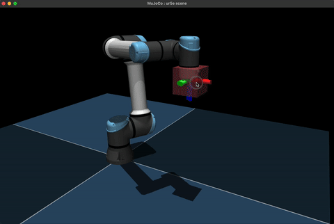
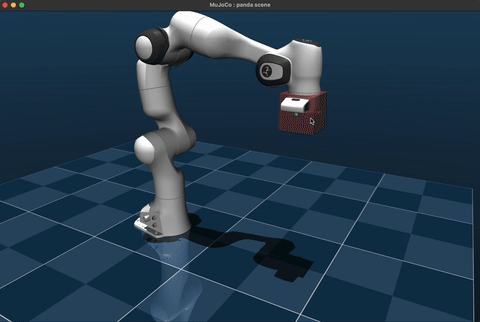
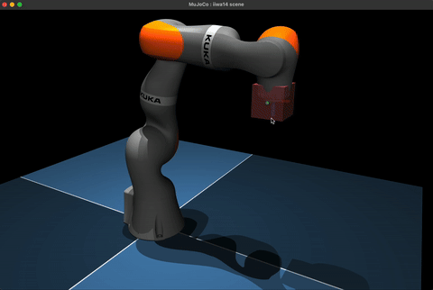

# MuJoCo Controllers

Single-file pedagogical implementations of common robotics controllers in MuJoCo.

## Installation

MuJoCo is the *only dependency* required to run the controllers.

```bash
pip install "mujoco>=3.1.0"
```

## Usage

| File | Video | Description |
|------|-------|-------------|
|`diffik.py`||Differential IK on a 6-DOF UR5e.|
|`diffik_nullspace.py`||Differential IK with nullspace control on a 7-DoF Panda.|
|`opspace.py`||Operational space control on a 7-DOF KUKA iiwa14.|

## Acknowledgements

Robot models are taken from [MuJoCo Menagerie](https://github.com/google-deepmind/mujoco_menagerie).

## References

- Samuel R. Buss 2009. Introduction to Inverse Kinematics with Jacobian Transpose, Pseudoinverse and Damped Least Squares methods. [PDF](https://www.cs.cmu.edu/~15464-s13/lectures/lecture6/iksurvey.pdf)
- Oussama Khatib 1987. A Unified Approach for Motion and Force Control of Robot Manipulators: the Operational Space Formulation. [PDF](https://khatib.stanford.edu/publications/pdfs/Khatib_1987_RA.pdf)
- Russ Tedrake, 2023. Robotic Manipulation: Perception, Planning, and Control. [PDF](http://manipulation.mit.edu)
